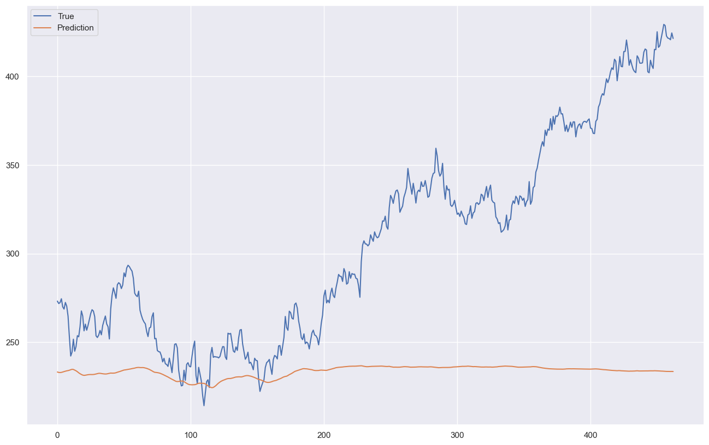
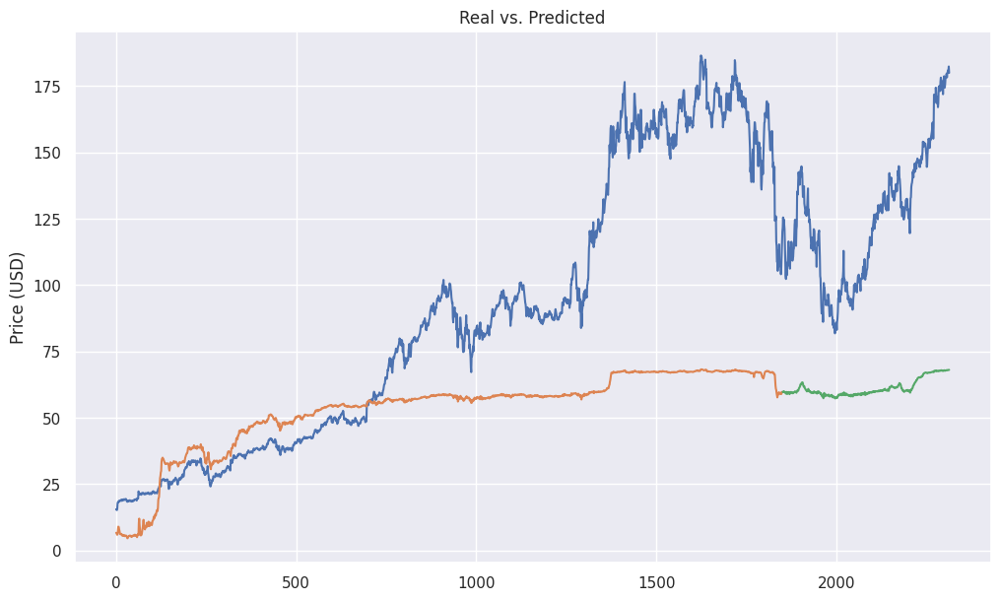

## Introduction
This notebook would introduce you to the process of feature selection and modelling multiple variables with the help of LSTMs. We also start off with a different model called Gated Recurrent Units or GRU in short.

These models are very similar to LSTMs when it comes to controlling the flow of information, however they are much more computationally efficient. This means you can get similar results without waiting a lot for the model to fit.

We will also cover the syntax and the details about defining a model in this notebook. The last section deals with stacking different layers on top of each other to increase the performance of the model, albeit taking other precautions to avoid overfitting.

### Setting Up
As usual, the cell below imports all the libraries and defines the parameters that we will be using to create these models.

```python
## Import Libraries and set information
from pandas_datareader import data as pdr
from datetime import date

import sys
import pandas as pd
import matplotlib.pyplot as plt
import numpy as np
from numpy import array
import math
from sklearn.metrics import mean_squared_error, mean_absolute_error
from sklearn.preprocessing import MinMaxScaler
from tensorflow import keras
from keras.models import Model
from keras.layers import Input, Dense, GRU, Dropout, concatenate, LSTM
from keras.optimizers import Adam
from keras.utils import plot_model
import yfinance as yf

from sklearn.model_selection import train_test_split
yf.pdr_override()

# Get Current Date
today = date.today()
currentDate = today.strftime("%Y-%m-%d")

# Set Info
start_date = '2015-01-01'
end_date = currentDate
stockName = ['AVGO', 'GOOG', 'MSFT', 'META', 'AAPL', 'NVDA']

#importing a csv file with list of stock symbols
comp_df = pd.read_csv("https://gist.github.com/chiragjes/d37f7f90446dfa3fe884634ee98562cd/raw/0754981ac6c2a89c6af71d51d76ccb13a97214ae/market_cap_lst.csv")

#comp_df.drop(comp_df[comp_df['Symbol'] == 'GOOGL'].index, inplace = True)
comp_df.sort_values(by=['marketcap'], inplace=True, ascending=False)

comp_df.head(16)
```

|    |   Rank | Name                      | Symbol   |     marketcap |   price (USD) | country       |
|---:|-------:|:--------------------------|:---------|--------------:|--------------:|:--------------|
|  0 |      1 | Microsoft                 | MSFT     | 2987705499648 |        402.09 | United States |
|  1 |      2 | Apple                     | AAPL     | 2611533840384 |        169.12 | United States |
|  2 |      3 | NVIDIA                    | NVDA     | 2217499951104 |        887    | United States |
|  3 |      4 | Amazon                    | AMZN     | 1802317725696 |        173.51 | United States |
|  4 |      5 | Alphabet (Google)         | GOOG     | 1640814346240 |        132.56 | United States |
|  5 |      6 | Meta Platforms (Facebook) | META     | 1264736796672 |        496.09 | United States |
|  6 |      7 | Berkshire Hathaway        | BRK-B    |  874852188160 |        403.96 | United States |
|  7 |      8 | Eli Lilly                 | LLY      |  740909383680 |        779.77 | United States |
|  8 |      9 | Broadcom                  | AVGO     |  625618321408 |       1350    | United States |
|  9 |     10 | Visa                      | V        |  576022839296 |        280.43 | United States |
| 10 |     11 | Tesla                     | TSLA     |  562242781184 |        176.54 | United States |
| 11 |     12 | JPMorgan Chase            | JPM      |  545916518400 |        189.53 | United States |
| 12 |     13 | Walmart                   | WMT      |  487757479936 |         60.57 | United States |
| 13 |     14 | Mastercard                | MA       |  439951884288 |        471.6  | United States |
| 14 |     15 | UnitedHealth              | UNH      |  435706036224 |        472.6  | United States |
| 15 |     16 | Exxon Mobil               | XOM      |  423646265344 |        106.77 | United States |

The table above shows the 15 most valuable companies in the US (according to market capitalization). We will check how their prioces are correlated with each other to make our models.

We are using the largest companies since their scripts are less likely to go through extreme fluctuations and have very high liquidity. The largest stocks also tend to reflect the overall sentiment of the market and therefore are more likely to fluctuate in similar directions, which makes them a good candidate for data that can be used to predict a particular stock.

stockNames = comp_df['Symbol'].head(15).tolist()
data_df = pd.DataFrame({})
for i in range(len(stockNames)):
    all_data = pdr.get_data_yahoo(stockNames[i], start=start_date, end=end_date)
    data_df[stockNames[i]] = all_data['Adj Close']
print(data_df.head())

## Correlation Matrix
This matrix represents the correlation between the top 20 most valuable companies on NASDAQ. You can see their symbols on the axes. It is useful to map out the correlations between different stocks to find the scripts that move together.

Out of all these scripts, we can see that Apple, Google, Microsoft and Tesla stocks are highly correlated with each other.

In this lesson, we will predict the price of a particular stock by combining the prices of different stocks and feeding it into the LSTM neural network. We will also see how we can increase the predictive power of our model by stacking multiple layers on top of each other.

In the previous lesson, we had seen how the parameters for the models were seemingly chosen randomly. In this lesson, we will explore what algorithms can be used to choose the best possible model.

```python
import seaborn as sns
#Create a correlation matrix with all the columns of data_df
corr_matrix = data_df.corr()
plt.figure(figsize=(12, 12))
#plot the correlation matrix
sns.heatmap(corr_matrix, annot=True)
```
## Multivariate Models
In the previous notebook, we were working on forecasting future stock prices with the help of past prices. We did not model anything else and made it exclusively about one stock. We had mentioned how we can use other variables to make our model better. In a regression analysis, one might add more predictors into the model to make it fit better.

Now, we start our foray into modelling different variables that could impact the price of a particular stock.

A multivariate model takes multiple values as an input. Instead of relying on only one series, we will have multiple to create a prediction for a particular stock's price.


A high positive correlation between two stocks implies that they are effectively moving together. An increase in stock A is accompanied by a subsequent increase in stock B. However, we cannot conclude that one stock is causing the other to move.

As you can see in the matrix above, stocks in the same sector tend to have very high correlation. This indicates that they share the same events and industry trends that drives their prices in the same direction. For eg. the correlation between microsoft and apple is 0.98. It is highly likely that if Apple's stock price is increasing, microsoft's is too. If there is an industry wide trend like increasing popularity of AI, both the stocks would go up.

If particular stocks move together, ideally we could use the other series as signals for a stock that we'd like to predict. It adds an alternate source of information, which could improve the accuracy of prediction. A univariate model on the other hand relies on the same series it is trying to predict.

## Data Pipeline

In order to build out the model, we would need to pre-process the data to meet the requirements of the LSTM model. Compared to the univariate case, it is much more important to be aware of how different shapes of datasets are expected by the model.

The first few steps like loading the price data from the yfinance API, filtering the close price and putting it in a dataframe are the same. Now, we will add the series into a different dictionary, with the stock names as keys and prices as list of values.  


Side Note: A dictionary is a data structure in python which consists of key:value pairs.

By using a dictionary, we can clearly see the stock names connected with their prices directly. In a list, we would have only seen the prices.
```python
price_dict = {}
```

```python
for i in range(len(stockName)):
  df_stock = data_df.copy()
  df_stock = df_stock.filter([stockName[i]], axis =1)
  price_dict[stockName[i]] = np.array(df_stock.values).flatten()

print(price_dict)
```

### Normalization Of Data

In the previous notebook, we saw how normalizing the data is an important step in the data pre-processing pipeline since it helps in standardizing all the values by condensing them between 0 and 1. We perform the same process here except this time we have created a function the normalizes the data, saves the scaler and reshapes the data according to our requirements.

Instead of doing this process manually every time, a helper function essentially abstracts away that process making your code more understandable and modular. This notebook extensively utilizes this approach during the preprocessing step.

```python
scaler_dict = {}

from sklearn.preprocessing import MinMaxScaler

def normalize_data(data, name):
    """
    Normalize the given data using Min-Max scaling.

    Parameters:
    data (numpy.ndarray): The data to be normalized.
    name (str): The name of the scaler.

    Returns:
    numpy.ndarray: The normalized data.

    """
    # Create a MinMaxScaler object with a feature range of (0, 1)
    scaler = MinMaxScaler(feature_range=(0, 1))
    # Reshape the data to have a single feature column
    data = data.reshape(-1, 1)
    # Normalize the data using the scaler
    normalized_data = scaler.fit_transform(data)
    # Store the scaler object in a dictionary with the given name as the key
    scaler_dict[name] = scaler
    # Return the normalized data
    return normalized_data
```

### Why did we use different scalers?

Different scaler objects are needed for different stock price datasets because each dataset may have unique characteristics such as different ranges, variances, or patterns in the data. For instance, one stock might fluctuate between 10 and 100, while another could range between \$500 and \$1000.

Using the same scaler for these datasets could distort the data's original structure, affecting the performance of machine learning models by giving undue weight to lower-priced stocks or failing to normalize the data correctly.

We did not have to consider this when we were working with only one time series.

Saving these scaler objects for inverse transformation is crucial because, after making predictions, we often want to convert scaled predictions back to their original scale to interpret results accurately.  Without the original scaler objects, the inverse transformation could be incorrect, leading to misinterpretation of the model's output and potentially costly mistakes in financial decision-making.

```python
normalized_stocks = {}
normalized_stocks_lst = []

for stock_name, stock_prices in price_dict.items():
    normalized_stocks[stock_name] = normalize_data(stock_prices, stock_name)
    normalized_stocks_lst.append(normalized_stocks[stock_name])
```

#### Combining Stock Prices

```python
norm_concat = np.column_stack(tuple(normalized_stocks_lst))
print(norm_concat[0:5, :])
```

```python
print(norm_concat.shape)
```
## Training Testing Split

```python
def training_data_x(data, window_size):
    """
    Create a new array containing windows of the given data.
    """
    # Calculate the number of windows that can fit in the data
    num_windows = len(data) - window_size
    # Create an empty array to store the windows
    new_array = np.empty((num_windows, window_size, data.shape[1]))
    # Loop through the data and create the windows
    for i in range(num_windows):
        # Add a window to the output array
        new_array[i, :, :] = data[i:i + window_size, :]
    return new_array

def training_data_y(data, window_size):
    return data[window_size:].reshape(-1,1)
```

The y value that we are trying to predict is microsoft. It is shaped differently compared to the x-values which have all the stock prices from our entire sample. We need to filter the microsoft stock prices and that's what we are doing here:
```python
norm_msft = norm_concat[:, 2]
```

norm_concat, as you saw before, has all the data for all the stocks. We can pass that directly to train_test_split module from the sklearn library. It would automatically split the data according to the ratio that we decide (0.2 in this case).

This function shuffles the data across training and testing sets by default. However, that would not be appropriate for our model since we need to make sure that sequence does not get inturrpted. More importantly, shuffling might introduce future data when then model is iterating through the past. This could give it hints about the structures that lie ahead and predict correctly without learning the underlying market movement.

```python
X_train, X_test, y_train, y_test = train_test_split(training_data_x(norm_concat, 15), training_data_y(norm_msft, 15), test_size=0.2, shuffle=False)
print(X_train.shape, y_train.shape, X_test.shape, y_test.shape)
```

```python
print(X_train[1:2, :, 0], y_train[0])
```

The two-dimensional array shown is a typical format used in time series forecasting models like LSTM in machine learning. This particular array is a single row (or time step) with fifteen features extracted from two different stocks' historical data. The values are normalized to be between 0 and 1to ensure uniform scale across different stocks and features.

The way these inputs are combined can vary based on the design of the model. Typically, for each day (that is the time step we choose here), data from the two stocks (e.g., their prices, volume, and other indicators) are processed to extract relevant features. These features are then concatenated into a single array, representing the combined state of these stocks at that particular time step. This array becomes the input for the LSTM model to predict the future price or movement of one targeted stock, indicated by [0.0065932] as the output (or target) for the next time step.

In this particular example, the features could be various measurements or derived statistical values from both stocks that the model considers important in predicting the future behavior of the targeted stock. The LSTM model would then use sequences of these arrays (spanning several days or time steps) to learn patterns and relationships between the features and the future stock prices.

```python
print(X_train.shape)
```

### LSTM Model 1
We will be using a simple one layer LSTM model in the beginning to fit the data and check how it performs. In the previous notebooks, we glossed over how designing a model and adding its hyperparameters works. This section uses a simple model to explain the role played by those values in determining the fit and performance of our model.

The main goal of training a machine learning model is to make predictions as accurate as possible. To achieve this, we need to ensure that the model's predictions closely match the actual outcomes in the training data. In this case, our model's predicted stock prices should be as close to the actual price as possible. The difference between the model's predictions and the actual outcomes is quantified using what we call a **loss function**.

The loss function is essentially a guide that tells us how well our model is performing; the lower the value of the loss function, the better our model's predictions are.

As our model iterates through the data, it would constantly need to adjust its parameters. This is where the optimizers step in. Optimizers are algorithms that guide the training process by adjusting the model's parameters in response to the output of the loss function. Think of the loss function as a terrain map showing high and low points, where the low points represent better model performance. The optimizer's job is to navigate this terrain, using the loss function as a guide, to find the lowest point possible. At this point, the model's predictions are at their most accurate.

In all the models so far, we have been using Adam Optimizer.


Sources: https://ml-cheatsheet.readthedocs.io/en/latest/optimizers.html

```python
def model1():
    input_concat = Input(shape=(X_train.shape[1], X_train.shape[2]), name='input_concat')
    x1 = LSTM(256, name='LSTM1_concat')(input_concat)
    output1 = Dense(1, name='msft_final')(x1)
    model1 = Model(inputs=input_concat, outputs=output1)
    adam = Adam(learning_rate=0.005)
    model1.compile(optimizer=adam, loss='mean_squared_error', metrics=['mae', 'mse'])
    return model1

model1 = model1()
```

### Baseline Model
This is the baseline model that we will use to judge the performance of all the other LSTMs. It is a basic one-layer model similar to the ones that we had in previous notebooks. This model has 256 neurons in one-layer.

This implies this particular layer consists of 256 distinct processing units (neurons). Each neuron in the layer operates as a small decision-making center that processes input data received either from the model’s input layer or a preceding layer and contributes to the model's ability to make predictions or decisions.

### Epochs, Batch Size and Learning Rate

#### Epochs

It represent the number of times the entire training dataset is passed forward and backward through a neural network. Each epoch involves exposing the network to the whole dataset, which helps the model learn from the data by adjusting the weights of the network connections.

The right number of epochs is crucial: too few may result in a model that hasn't learned enough to understand the underlying patterns of the data (underfitting), while too many can lead the model to learn too much detail, including noise and anomalies (overfitting). Finding the optimal number of epochs generally involves experimentation and monitoring model performance on a validation set, stopping training when improvement plateaus.

#### Iterations

An iteration consists of one batch being passed through the network. Every epoch has multiple iterations and the number of iterations depends on the size of the batch. If we have a very large batch (maximum being the entire training dataset), the model will have one iteration. One the other hand, if our batch size is very small, we will need multiple iterations to finish one epoch.

#### Batch Size
This training samples used to perform one update of the model's weights. Smaller batch sizes generally provide a more accurate estimate of the gradient, but can be noisy and converge irregularly. Larger batch sizes provide a more stable and less noisy estimate but may result in a poorer generalization to new data. The choice of batch size affects the model’s performance, computational efficiency, and convergence behavior. The ideal batch size often depends on the specific characteristics of the data and computational constraints.


To summarize, one epoch involves the entire training dataset passing through the model. This epoch uses broken down chunks of training data for one iterations, and the batch size decides how big one chunk will be.

Sources: https://medium.com/data-science-365/all-you-need-to-know-about-batch-size-epochs-and-training-steps-in-a-neural-network-f592e12cdb0a, https://deeplizard.com/learn/video/U4WB9p6ODjM

### Optimizing the Hyperparameters
Take a look at the graph below to recall underfitting and overfitting from the previous notebook.

When we increase the batch size, the amount of information that a model has to process in one-go also increases. This could lead to underfitting, since the model would not be able to learn everything quickly. On the other hand, if our batch size is too small, we will require a lot of time and computation processing power to process every sample in one iteration.

Similarly, epochs influence the overall performance of the model too. High number of epochs would possibly lead to the data being overfit, since the model would have seen the data multiple times and in the process optimized its weight based on the noise along with learnable features. If the number of epochs is less, the model would not get the opportunity to learn from the data to begin with, causing underfitting.

We also need to adjust other aspects of the model when we make these changes. One example could be, if our batch size is large, our model's learning rate might have to be increased too.

Source: https://medium.com/geekculture/how-does-batch-size-impact-your-model-learning-2dd34d9fb1fa


Source: https://www.sabrepc.com/blog/Deep-Learning-and-AI/Epochs-Batch-Size-Iterations

#### Contextualizing this Model

If we were to look at the model below, the batch size is 32, epochs are 50 and the validation_split is set at 0.2.

This implies, there are 32 samples being passed to the neural network in one iteration. To check how many times this happens, take a look at the output of the cell below. The number on the left of the loading bar represents the number of iterations that the model went through.

```python
# Fitting Model
history = model1.fit(x=X_train, y=y_train, batch_size=32, epochs=50, validation_split=0.2, shuffle = False)
evaluation = model1.evaluate(X_test, y_test)
print(evaluation)
```
```python
# Make plots to visualze loss and val_loss from evaluation
plt.plot(history.history['loss'], label='loss')
plt.plot(history.history['val_loss'], label='val_loss')
plt.legend()
plt.show()
```
```python
## Make Predictions
y_pred = model1.predict(X_test)
y_pred = scaler_dict['MSFT'].inverse_transform(y_pred)

## Use seaborn to plot everything in this code cell
import seaborn as sns
sns.set()
plt.figure(figsize=(16, 10))
plt.plot(scaler_dict['MSFT'].inverse_transform(y_test), label='True')
plt.plot(y_pred, label='Prediction')
plt.legend()
```

```python
## Make the model predict the training set to see how well it fits the data
y_pred_train = model1.predict(X_train)
y_pred_train = scaler_dict['MSFT'].inverse_transform(y_pred_train)
## Plotting the Predictions
plt.plot(scaler_dict['MSFT'].inverse_transform(y_train), label='True')
plt.plot(y_pred_train, label='Prediction')
plt.legend()
plt.show()
```

### Adding more Predictors
In the previous model, we used the close price of 6 stocks to construct our predictions. What will happpen when we take more data about these stocks into account? There are two possibilities that lie ahead of us:

1. Improvement: Either our model will start perfoming very well by learning the market microstructures present in other stocks, thereby reducing our test and validation loss.
2. Noise: More data also means more noise for the model to sort through. It is possible that our model "gets distracted" with minute fluctuations, and fails to capture patterns that are being repeated. This would show up as an increase in loss and val_loss.

We will be adding more OHLC data about all the stocks in the next model.

```python
stockName = ['AVGO', 'GOOG', 'MSFT', 'META', 'AAPL', 'NVDA']

# Create an empty data frame
all_data = pd.DataFrame()

# Iterate over the stock names and fetch data from Yahoo Finance
for stock in stockName:
    stock_data = pdr.get_data_yahoo(stock, start=start_date, end=end_date)
    all_data = pd.concat([all_data, stock_data], axis=1)

```

```python
#Adding all the OHCL data in one dataframe with multi-level columns
all_data.columns = pd.MultiIndex.from_product([stockName, ['Open', 'High', 'Low', 'Close', 'Adj Close', 'Volume']])
# Remove the volume and adjusted close columns from the dataframe
all_data = all_data.drop(['Volume', 'Adj Close'], axis=1, level=1)
```

#### Close Price vs OHLC
The overall stock price movement captured only through the close price provides a snapshot of the stock's final trading value at the end of the trading day. This single data point represents the last transaction that occurred before the market closed, which can be useful for analyzing the stock's performance day-over-day. We used this figure to assess the daily net change in a stock's price, which is key in evaluating its longer-term trends and stability.

On the other hand, capturing stock price movement throughout the day involves analyzing the stock's price action including its open, high, low, and close prices (often referred to as OHLC data). This approach provides a more comprehensive view of the stock's volatility and trading behavior within the trading day.

- Open Price: This is the price at which a stock first trades upon the opening of an exchange on a trading day.
- High Price: The highest price at which a stock traded during the course of the day. It shows the peak optimism or buying pressure for the day.
- Low Price: The lowest price at which the stock traded during the day, indicating the point of maximum pessimism or selling pressure.
- Close Price: As mentioned, this is the last price at which the stock trades before the market closes.
By examining all these aspects, investors can gain insights into the intraday strength or weakness of the stock, which could be triggered by market news, investor sentiment, or external economic events. This detailed breakdown helps traders and investors make more informed decisions, especially for those who engage in intraday or technical trading. It also helps in understanding how external factors or market news impact stock prices within the same trading session.

```python
all_data.head()
```

```python
def normalize_data(data, stock_names):
    normalized_stocks = {}
    scaler_dict = {}

    for stock_name in stock_names:
        stock_data = data[stock_name]

        for column_name in stock_data.columns:
            column_data = stock_data[column_name]
            scaler = MinMaxScaler()
            normalized_column = scaler.fit_transform(column_data.values.reshape(-1, 1))

            normalized_stocks[f"{stock_name}_{column_name}"] = normalized_column
            scaler_dict[f"{stock_name}_{column_name}"] = scaler

    return normalized_stocks, scaler_dict
```

```python
ohcl_stocks, ohcl_scaler_dict = normalize_data(all_data, stockName)
ohcl_stocks_values = list(ohcl_stocks.values())
ohcl_norm_concat = np.column_stack(tuple(ohcl_stocks_values))
index_number = list(ohcl_stocks.keys()).index('MSFT_Close')
ohcl_norm_msft = ohcl_norm_concat[:, index_number]

ohcl_X_train, ohcl_X_test, ohcl_y_train, ohcl_y_test = train_test_split(training_data_x(ohcl_norm_concat, 15), training_data_y(ohcl_norm_msft, 15), test_size=0.2, shuffle=False)

print(ohcl_X_train.shape, ohcl_y_train.shape, ohcl_X_test.shape, ohcl_y_test.shape)
```



#### Shape of Arrays

Take a look at (1851, 15, 24) shape of the X_train series. 1851 and 15 are the same as our previous model because they represent the number of days and the window size.

24 has changed from 6. This can be understood as the number of columns in our dataset. Previously, we had 6 columns for 6 stocks. Now, we have 24 columns for OHLC data of 6 stocks.



### Model Definition

This model is the same as the previous one. Training data is the only difference here.

```python
def model3():
    input_concat = Input(shape=(ohcl_X_train.shape[1], ohcl_X_train.shape[2]), name='input_concat')
    x1 = LSTM(256, name='LSTM1_concat')(input_concat)
    output1 = Dense(1, name='msft_final')(x1)
    model1 = Model(inputs=input_concat, outputs=output1)
    adam = Adam(learning_rate=0.001)
    model1.compile(optimizer=adam, loss='mean_squared_error', metrics=['mae', 'mse'])
    return model1
model3 = model3()
```

```python
history1 = model3.fit(x=ohcl_X_train, y=ohcl_y_train, batch_size=32, epochs=50, validation_split=0.2, shuffle = False)
evaluation1 = model3.evaluate(ohcl_X_test, ohcl_y_test)
print(evaluation1)
```


### Results

This model's validation loss metrics are slightly higher than the previous model, suggesting the possibility of overfitting.

```python
plt.plot(history1.history['loss'], label='loss')
plt.plot(history1.history['val_loss'], label='val_loss')
plt.legend()
plt.show()
```

```python
## Make Predictions
y_pred2 = model3.predict(ohcl_X_test)
y_pred2 = ohcl_scaler_dict['MSFT_Close'].inverse_transform(y_pred2)
import seaborn as sns
sns.set()
plt.figure(figsize=(16, 10))
plt.plot(ohcl_scaler_dict['MSFT_Close'].inverse_transform(ohcl_y_test), label='True')
plt.plot(y_pred2, label='Prediction')
plt.legend()
```

### Results (contd.)
Actual difference between both the models is apparent in the second graph where we see how far apart its predictions are. The testing predictions of the model were unable to grapple with the sudden price movement in the Microsoft stock. It is possible that adding this much training data would have made the model lose track of this stock.

This shows how more data is not always the best way to improve a model. We need to holistically consider all the possibilities when making a change. It also shows how we can't accurately hypothesize the performance of a neural network and experimentation more often than not is necessary.

## Multilayer Model

The previous exercise showed how we can add more features to our dataset, but even then the model can fail to generalize. We should then explore the possibility of adding more LSTM layers to the model. As you saw in the previous notebook, a layer comprises of multiple LSTM cells whose job is to control and processs the flow of data. All the models so far have been shallow models: one input layer, hidden layer and one output/dense layer. Now, we will build deep LSTM models which have multiple hidden layers.

### How does it work?
The first layer processes the training data from the input layer. After that, the full sequence of outputs (hidden states for each time step) is passed to the next layer. Each following LSTM layer receives the sequence of outputs  from the preceding layer as its input.

Just like the first layer, these layers process the input sequentially, updating their internal states and producing outputs for each time step.
These layers can further abstract and build upon the features extracted by previous layers, allowing the model to form more complex representations.Typically, the first LSTM layer captures basic patterns, which are then refined by subsequent layers.

Stacking layers can help the model to learn more complex patterns and perform better on tasks that require understanding of context over longer sequences.

### Implementation
There are two crucial components that your model configuration should have in order to enbale stacking:
1. return_sequences = True: This is an argument in the LSTM layer. It enables the layer to return the hidden state output for each input time step. Without this, subsequent layers would nt receive the weights captured by the first layer. The last layer has to have this set to False, since it provides the output.
2. Dropout: It randomly sets a fraction of input units to 0 at each update during training time, which helps to make the model robust by preventing it from relying too heavily on any individual neuron. This is not necessary for a stacked LSTM, however, it is highly recommended otherwise the model might overfit. It adds randomness to the training process, which can affect the learning ability of the model. If there are too many dropout layers or if the fraction is set too high, the model will fail to learn since a larger of weights were set to zero.

Source: https://towardsdatascience.com/from-a-lstm-cell-to-a-multilayer-lstm-network-with-pytorch-2899eb5696f3, https://machinelearningmastery.com/stacked-long-short-term-memory-networks/


Source: https://medium.com/@hadarsharvit/why-should-we-care-about-a-deep-network-0bcce5e39ff4

### Results


As you can see, the loss is still comparable to other models that we have far. The issue lies in validation loss, which is exponentially higher than our previous models. It suggests that our model has not been able to capture the features that govern stock price movements and when it encounters data outside what it was trained on, it is unable to predict the movemnt.

The first graph shows the model's performance on the testing set. The predictions have barely captured any of the features of the stock price movement. In the second graph, we can see that even though the model could predict the series until 1250, beyond that it has not been able to capture the variance.

This is problematic because it means the model can not calculate the predicted price beyond a certain point. It seems that even during training, it lost its ability to learn while accommodating the entire dataset. This is not uncommon and might have been caused due to the nature of recurrent models (family of models, LSTM is a part of it). Multiple layers can compound this issue because the weights get calculated several times in one epoch.

Source: https://medium.com/@prudhviraju.srivatsavaya/advantages-and-disadvantages-of-using-multiple-lstm-layers-9c513cd0002c

## Vanishing Gradient Problem
When we initialize a neural network, we intend to minimize the loss (the difference between predicted value and the data). A neural network learns by adjusting its weights to minimize the loss. This learning process is facilitated through backpropagation, where the loss is propagated backwards through the network to update the weights. The updates are made based on the gradient of the loss function with respect to each weight. The gradient represents how much a small change in that weight affects the value of the loss function. In simpler terms, it measures the sensitivity of the loss function to changes in that particular weight.

If the gradient is small (essentially, the loss function is not being sensitive to the changes in that particular weight), the further updates to that weight are going to be very small too.

This cascades through the network. Ideally, this change in weight is supposed to get propogated through the network through derivates and multiplication. When the updates to weight are small, products of smaller numbers with other very small numbers gives miniscule results. Come to think of it, in the network above, multiple layers implies these calculations occur more frequently than a typical single layer network.

LSTMs are supposed to mitigate this issue by having the architecture we discussed in the previous notebook. The memory and forget cells regulate what a network remembers and thereby ensuring the weights get updated with new information constantly.

Sources: https://www.baeldung.com/cs/lstm-vanishing-gradient-prevention, https://www.mygreatlearning.com/blog/the-vanishing-gradient-problem/, https://deeplizard.com/learn/video/qO_NLVjD6zE


## New Models
Now, we'll look at two architectures that serve different purposes. GRUs are similar to LSTMs in terms of controlling the flow of information, however, they require less computational resources. RNNs are a class of recurrent models that were invented before LSTMs. The vanishing gradient problem was observed in them, which inspired the creation of LSTMs.

### GRU Model


GRUs or Gated Recurrent Units are a type of recurrent neural networks that have three primary gates:

1. Update Gate: This gate decides how much of the past information (from previous time steps) needs to be passed along to the future. It helps the model determine the amount of the previous hidden state that should carry over. This gate is similar to the combination of the forget and input gates in an LSTM, which decide what information to discard and what new information to add.

2. Reset Gate (r): This gate determines how much of the past information to forget. This can be thought of as a way to make the network consider only the necessary information without being burdened by irrelevant data from the past.

The architecture is simpler than an LSTM, which enables the network to get optimized quickly without using more computational resources.

Source: https://towardsdatascience.com/understanding-gru-networks-2ef37df6c9be, https://d2l.ai/chapter_recurrent-modern/gru.html


### Results
In the validation loss plot, we can see that the model had minimized loss at 20th epoch or so. Simpler model architecture has allowed it to converge earlier than expected. The validation loss increases drastically after that point.

Recall the discusion about epochs in the previous cell, here we can see the results practically. Training a model beyond its optima has led to overfitting. During the last few epochs, the model was probably memorizing the noise present in the data and thus loss shot up.

### Results (contd.)
In this graph, we can see how this model performed well on the testing set until the inputs became extremely large. The model could not keep track with changes, but it has managed to abstract away some features that capture the directional price movement, leaving the value aside.

### RNN Model
Recurrent neural networks or RNNs were developed when researchers observed how classic neural netwroks were unable to retain the information fed to them. When the model iterated through the input, they forgot what was in the beginning. Recurrent neural networks solve this issue by processing the inputs sequentially. Each input is considered one at a time, and its information gets stored in the hidden state.

When the next input comes along, the model loops through its hidden cell to recall what it had learned previously. It then combines it with the current input. The model updates its hidden cell again and moves ahead through the sequence. The process is called recurrent because it repeats the same task (updating its state and producing an output) for every element of the input sequence. The same parameters (weights and biases) are used at each step, which is efficient and effective for learning from data where order and context matter.

The memory capacity of an RNN is a lot smaller than a LSTM and it cannnot retain information that was fed into it a long time ago. Therefore, it has short-term memory.

Source: https://www.theaidream.com/post/introduction-to-rnn-and-lstm, https://stanford.edu/~shervine/teaching/cs-230/cheatsheet-recurrent-neural-networks


### Results
The model has performed well judging by the loss metrics. The validation loss is very high in the beginning, which is expected since the model has not seen the data yet. We can see that the validation loss increases slightly in the middle and this fluctuations happen at almost the same pace. This might indicate model updating its short-term memory and thereby temporarily losing its predictive ability.

### Results (contd.)
When the model is made to predict its training set, we see that it is extremely volatile. The model also overstimates the prices by a large margin in the beginning. The predictions mirror the trends, while exaggerating the volitality by a large margin.

This can possibly be the result of short-term memory. The predictions are based on the last 15-20 days of trend that the model was fed through the sliding windows in X-train. This means, it has not extracted the features that it observed in the beginning (or even a few months before the date of prediction). This has led to a low loss because the prices fluctuate in the same range of values in a particular time-frame. The model can get this right by predicting a value that deviates slightly from the last observed price.

This model might be useful for short-term predictions but one should be vary of erratic results, given how high of a value it outputs towards the end of testing set.


## Hyperparameter Tuning

Hyperparameters are settings that govern how a neural network will fit through the data. They are set before training begins and are not learned from the data. These include epochs, batch size, learning rate etc. So far, we have been setting them arbitrarily, which mean we might not discover the optimum value where the network finds the best possible weights for our model.

It is very important to be thoughtful while setting them, otherwise our model might behave unpredictably. As you saw before, they also have the tendency to interact with each other. For eg. if we use a high learning rate while having a lot of cells in the layer, our model might overfit. In general, we need to be cautious when we set them manually.

To avoid these situations, we use hyperparameter tuning. There are several algorithms that make the process of choosing the correct hyperparameter easy. We'll use the hyperbannd tuner in the tensorflow library in this notebook to show how tuning can be implemented.

For this example, we'll use a univariate array akin to the first notebook. We use microsoft's closing price to predict itself. We are not using more complex inputs since the process of tuning hyperparameters takes a long time.

### Hyperband Tuning Algorithm
This algorithm is based on the idea of "successive halving". This method was invented out of the necessity to save time and computational resources, while making sure that we get to experiment with as many hyperparam values as possible. In each iteration, successive halving keeps the best halve of the configurations and discards half of the algorithms that are not good. It will continue until we have just one single configuration.

Hyperband takes this one step ahead by performing successive halfing on asmall subset of the data. It experiments with several parameters in the beginning and iterates through them quickly. It evaluates the performance of all these configurations and then selects only the most promising ones to continue to the next round, where they are given more time. This ensures highly unoptimal values get pruned early on and the ones who do have a decent shot at being optimal are given the opportunity to explore the model.

Source: https://neptune.ai/blog/hyperband-and-bohb-understanding-state-of-the-art-hyperparameter-optimization-algorithms


We can use the output of the cell above as the hyperparameter to train a new and simple LSTM model.

## Conclusion
Throughout this notebook, we've explored several advanced topics within the realm of neural networks. This notebook began with exploring what would we need to do add more predictors to our model. We calculated the correlation of high market cap stocks and chose the companies we'd like to use as features. We then understood the basics of multivariate LSTM models, which are capable of processing multiple input variables simultaneously, making them ideal for complex scenarios.

To increase the model complexity and add even more data, we then delved into multilayer LSTM models, which involve stacking multiple LSTM layers to enhance the model's ability to capture deeper patterns and longer dependencies. Alongside, we addressed the crucial challenge of the vanishing gradient problem, which can hinder the training of deep recurrent networks, and discussed how it impacts learning in deep network architectures.

To address some of the shortcomings of traditional LSTMs, we introduced Gated Recurrent Units (GRUs), a simpler yet efficient alternative to LSTMs. We also analyzed how RNNs perform on the same dataset. It enabled us to see what short-term memory models are capable of. Finally, we covered hyperparameter tuning, which helps us find optimal settings for our model.

