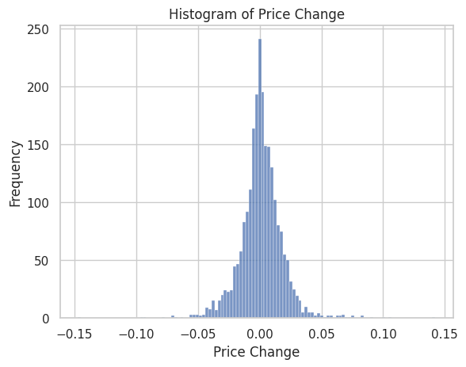
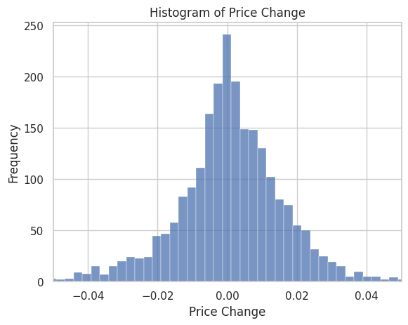
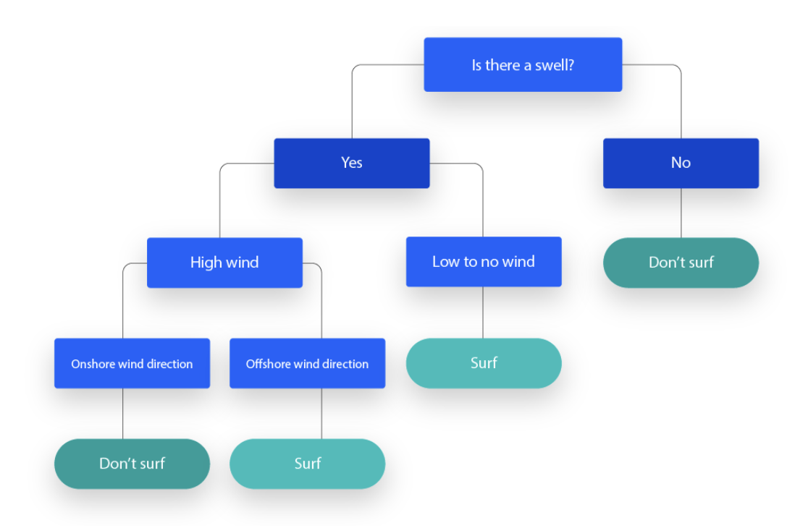
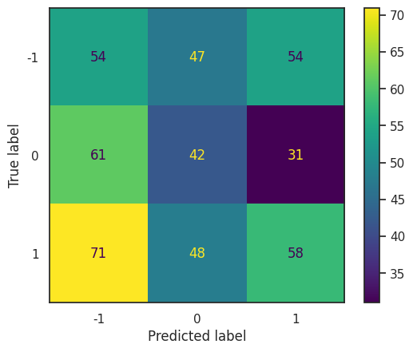
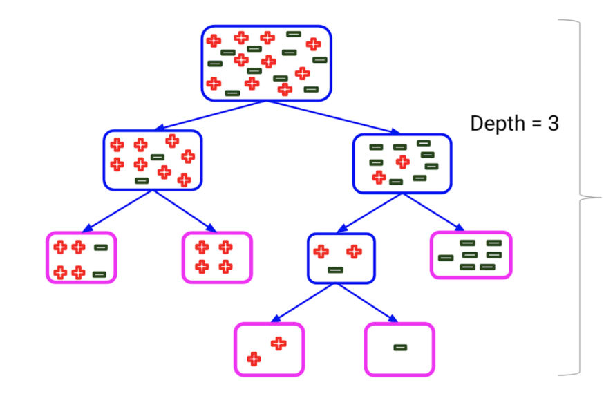
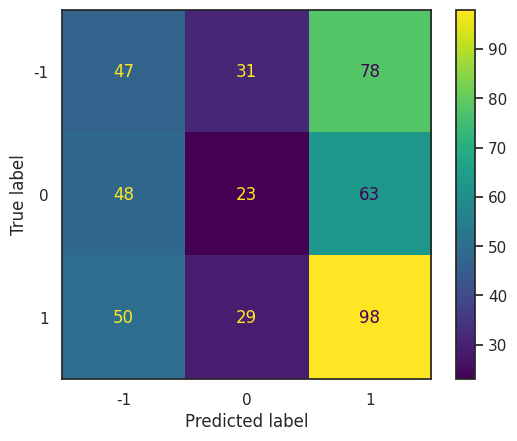
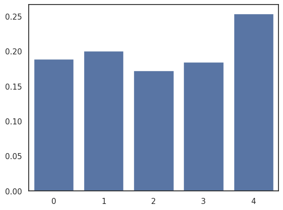
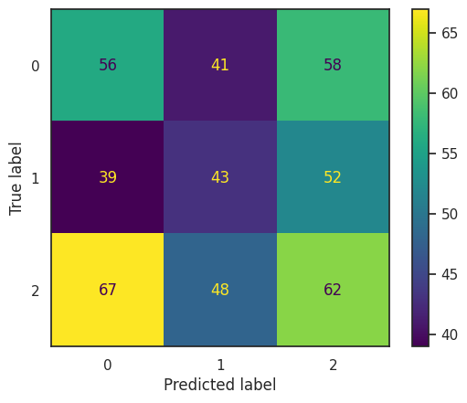
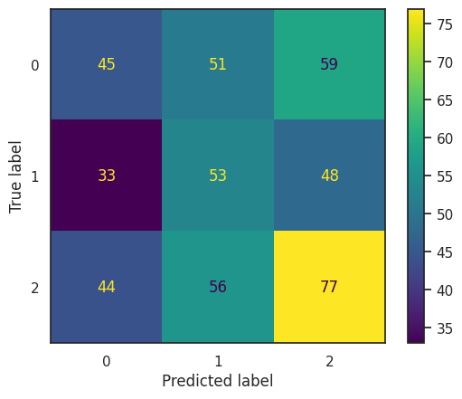
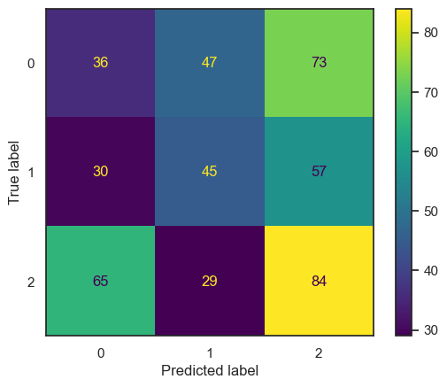

## Introduction

This notebook focusses on reframing stock market prediction into a
classification problem instead of predicting a time-series. We are also
introducing tree-based models which are very different from the
artificial neural networks that we have looked at before. This means the
hyperparameters, loss metrics and data preprocessing will be different
too.

As usual, we start off with a very simple model and univariate data to
understand the underlying basic concepts and then we build up on it by
adding more features and using other model architectures. There are
three models we work on: Decision trees, Random Forests and XGBoost. We
will also look at indices and other data that capture the overall market
sentiment.

```python {27-30}
## Import Libraries and set information
from pandas_datareader import data as pdr
from datetime import date
import sys
import pandas as pd
import matplotlib.pyplot as plt
import numpy as np
from numpy import array
import math
from sklearn.metrics import mean_squared_error, mean_absolute_error
from sklearn.preprocessing import MinMaxScaler
from sklearn.model_selection import train_test_split
from tensorflow import keras
from keras.models import Model
from keras.layers import Input, Dense, GRU, Dropout, concatenate, LSTM
from keras.optimizers import Adam
from keras.backend import square, mean
from keras.utils import plot_model
import yfinance as yf

yf.pdr_override()

# Get Current Date
today = date.today()
currentDate = today.strftime("%Y-%m-%d")

#See note below
start_date = '2015-01-01'
end_date = currentDate
stockName = ['MSFT']
```
:::note
We're using Microsoft stock here, you can try using it with other stocks.
Make sure that you don't add multiple stocks here, as the model is programmed to handle only one stock's data.
:::

## Classification vs. Prediction

In the previous notebooks, when we were predicting stock prices, we were
trying to forecast the actual future value of a stock. This approach
focuses on absolute numbers, aiming to pinpoint what the price of a
stock will be at a specific future time. For example, predicting that a
stock currently priced at \$100 will rise to \$105 tomorrow. Since these
models aim to minimize the difference between the predicted and actual
prices, a prediction that is numerically close to the actual price but
in the opposite direction (e.g., predicting a price decrease when the
price actually increases) might still be considered successful from a
model\'s perspective.

Continuing the previous example, if the model predicts that the price
will be \$102 and it turns out to be \$99, we will have a difference of
\$3, but the direction would be switched. On the other hand, if this
same model was optimizing to predict \$95, the direction would be
correct but the loss would be higher at \$4. The optimizer (or our
judgment, while considering val_loss) would then choose the \$102 model
over the one that gives correct directional movement.

The model\'s predictions could therefore lead to losses or missed
opportunities. To solve this problem, we can think of stock market
prediction as directional movement prediction. Instead of predicting the
exact price, why don\'t we try predicting if it would increase or
decrease? By changing our prediction goal, we are essentially reframing
the time-series prediction problem into a classification problem.
```python
data_df = pd.DataFrame({})
for i in range(len(stockName)):
    all_data = pdr.get_data_yahoo(stockName[i], start=start_date, end=end_date)
    data_df[stockName[i]] = all_data['Adj Close']
print(data_df.head())
```

## Data Pre-Processing

Previously, we were focussed on normalizing the inputs and arranging
them into an array that a LSTM model would be able to process. In this
case, we don\'t have constraints on the size or scale of our inputs. We
need to find a way to encode the change in direction of price movement.
We can do that by calculating the change in close price of a stock.

Pandas, our data processing library, has a function that can calculate
the percentage change in a particular column. We will save the changes
in a separate column called price change. This value shows how much the
stock moved between two days and in what direction.

```python
data_df['Price Change'] = data_df['Close'].pct_change()
data_df = data_df.dropna()
data_df.head()
```


Before moving ahead with preprocessing, we will perform some exploratory
data analysis.

Here, we can see the distribution of daily returns for Microsoft. The
numbers on the x-axis show how much the stock moved (percentage change),
and the y-axis shows the frequency of this change. This figure shows
that the theory about stock market returns being normally distributed is
true, however the tails of this distribution are thicker than one would
expect.

Most of the mass lies around 0.05 and -0.05, signalling that it is
fairly rare for the market to move by values greater than that. The wide
range of outliers distorts our view and prevents us from seeing the most
frequent daily returns.





After limiting the x-axis, we can see how the most frequent fluctuations
are limited to values around 1% or even less than that. These minute
fluctuations signal volitality, and are fairly difficult to predict. Not
to mention, how sensitive to directional classification they would be,
since the difference between positive and negative change is reduced.



### Categorization

The histogram representation and the dataframe show us how he values in
price change column are continuous. Now that we have redefined our
problem statement to predict signals instead of values, we would need to
transform our data to reflect this change. This involves creating three
distinct categories: buying, holding, and selling, based on the
percentage change in the stock price.

The rationale for encoding \"buy\" when the price increases by more than
0.5% is to capture significant upward movements that might indicate a
bullish trend, suggesting a potential profit opportunity for us.
Conversely, encoding \"sell\" for decreases greater than 0.5% aims to
identify significant downward trends, indicating a bearish market or a
potential loss. The \"hold\" category is encoded for percentage changes
between -0.5% and 0.5%, representing minor fluctuations in the stock
price that might not justify the transaction costs associated with
buying or selling.

This categorization allows the model to focus on the decision-making
aspect, which is predicting the most appropriate action based on
historical data, rather than trying to forecast precise future prices.
Our algorithm would therefore identify the signals that are most closely
associated with movement in Open, high low or volume data.

```python
## Create a new column called 'Category' that categorizes the price change 
## into 3 categories: -1 (sell), 0 (hold), 1 (buy)

data_df['Category'] = pd.cut(data_df['Price Change'], bins=[-np.inf, -0.005, 0.005, np.inf], labels=[-1, 0, 1])
data_df.head()
```

As you can see below, our dataset comprises of 861 buy signals, 776 hold
signals, and 692 sell signals. It is apparent that the distribution is
somewhat imbalanced, with buy signals being more prevalent. This
imbalance can lead to a scenario where a classification model, by simply
defaulting to predict the most common class (buy), can achieve a
relatively high accuracy score.

This is problematic because such a model isn\'t genuinely learning or
discerning the underlying patterns in the data; rather, it\'s
capitalizing on the skewed distribution of classes.

Consequently, the model would frequently misclassify hold and sell
signals as buys, which could potentially lead to losses. To diagnose
when this is happening, we can employ a confusion matrix which will help
us judge its effectiveness in correctly predicting each class and
revealing any biases towards the majority class.


As you can see above, the rows have been labeled according to our
criteria in the category column. But, this label has been assigned based
on the price change on that particular day. This information is not
useful for us. Suppose you have all the data until 10th January. The row
labeled 10th January would have the price fluctuation on that day and
the model would predict the category for the same day.

Rather, we want to know what will happen on 11th January based on all
the information until 10th. So, our model should output the trade that
we take on 11th based on the prices on 10th. This means, the model needs
to know what has happened on the NEXT day based on today. The row for
2nd January would have the outcome for 3rd January\'s trades, 3rd would
have the outcome for 4th, 4th will have 5th\'s results and so on.

Our training data needs to reflect what our goals are and therefore has
to be arranged accordingly. Therefore, we will shift all the category
labels by one day to make sure every row has the output that we want.

```python
data_df["Tomorrow"] = data_df["Category"].shift(-1)
```

If you take a look at the category and tomorrow columns, you will see
that the values have moved forward by one day. We will now split the
data for training and testing.

### Data Leak

Data leakage occurs when information from outside the training dataset
is used to create the model, leading to a scenario where the model has
prior knowledge about the test set.

This situation can inadvertently arise when the process of preparing and
splitting the dataset into training and testing sets is not handled
correctly, resulting in the model being exposed to or \"leaking\"
information that it should only encounter in the testing phase.

The purpose of splitting the data into train and test sets is to
estimate the performance of our model in real life. When the model
directly or indirectly learns about the features in the testing set, it
will perform well on it, which would lead us to overestimate its
learning capacity.

In order to mitigate this problem, we have to remove the category, price
change and tomorrow column from the training set because they are the
features that we want to predict. Tomorrow column is a part of the
y_test and y_train sets because that is our outcome variable. We are
removing the category column to be safe and ensure that the column does
not learn that the outcome variable is essentially category shifted by
one.

The price change column is being removed because we want the model to
focus on absolute values and derive the pattern regarding change in
prices on its own. It would also create inconsistency since all the
other features are absolute prices. If we were training a model
exclusively based on change in all features then we could\'ve retained
it.


```python
# Splitting the data into training and testing sets as before.
X_train, X_test, y_train, y_test = train_test_split(data_df.drop(['Category', 'Tomorrow', 'Price Change'], axis=1), data_df['Tomorrow'], test_size=0.2, shuffle=False)
```

## Decision Tree Model

Decision trees are a type of supervised machine learning algorithm that
operates on a rule-based mechanism for making decisions, similar to the
way humans approach decision-making. The essence of a decision tree in
the context of classification is to assign a class (buy/sell signal) to
a new, unseen input based on a series of yes/no questions derived from
the features of the dataset (in our case, OHLC data). This process
resembles how we, as humans, make decisions in everyday life.

For instance, when investing in a new startup, your firm has a hard
limit on only considering companies that have atleast 200K in revenue.
Then, they look at profitability and only consider companies that have
10% margins or invest 25% of their revenue at most for customer
accquisition. They might have more criteria along these lines, and you
can find them when you look through past investments. In the end, you
would be left with a flow-chart while having categorized all the
startups that were invested in compared to the ones that weren\'t.

Similarly, the algorithm creates a tree-like model of decisions and
their possible categories. In very simple terms, it is a collection of
if-else statements that classify the target variable.

```python
from sklearn.tree import DecisionTreeClassifier
model = DecisionTreeClassifier()
model.fit(X_train, y_train)
```

### How it works?

In more technical terms, a decision tree uses the data\'s features to
systematically split the dataset, aiming to isolate the data points
belonging to each class into the smallest possible groups. This
splitting process results in a tree structure where each node represents
a feature (or attribute), each branch represents a decision rule based
on the value of that feature, and each leaf node represents the outcome
or class label. The process starts from the root node, which represents
the initial feature that best separates the data into distinct classes.
From there, the dataset is partitioned recursively. This method is known
as recursive partitioning.

This structure not only aids in decision-making but is also simple to
understand and interpret, akin to a flowchart.





### Results

Previously, we used descriptive statistics like mean average error to
calculate how accurate our model was at predicting the
testing/validation test. The fundamental idea behind that metric was
measuring how much the predictions of the model differ from the actual
data set.


#### Accuracy

Accuracy is the most intuitive metric for this purpose; it is calculated
by comparing the actual and predicted classes of each data point. A
correct match between the predicted and actual class is considered a
correct prediction. The accuracy is then derived by dividing the number
of correct predictions by the total number of predictions made. For
instance, if a spam classifier makes 15 correct predictions out of 20
attempts, it achieves an accuracy of 75%.

#### Precision

Precision is focused on the quality of the positive predictions made by
the model. It is calculated as the ratio of correctly predicted positive
instances (true positives) to the total number of instances predicted as
positive (the sum of true positives and false positives).

$$
\text{Precision} = \frac{\text{True Positives}}{\text{True Positives} + \text{False Positives}}
$$

Here, it refers to the proportion of predicted buy signals that were
actually correct. For instance, if the algorithm predicts 100 buy
signals but only 80 of these predictions are correct, the precision of
the buy signal prediction is 80%. High precision indicates that when the
model predicts a buy signal, it is highly likely to be correct,
minimizing the risk of executing unprofitable trades based on false
signals. Precision is crucial for investors who prioritize minimizing
false positives (erroneous buy signals) to avoid unnecessary transaction
costs or potential losses.

#### Recall

Recall, on the other hand, is concerned with the model\'s ability to
capture all relevant cases. It is determined by the ratio of correctly
predicted positive instances (true positives) to the actual total number
of positive instances in the data (the sum of true positives and false
negatives).

$$
\text{Recall} = \frac{\text{True Positives}}{\text{True Positives} + \text{False Negatives}}
$$


For example, if there were 100 actual buy signals in the dataset and the
model correctly identified 55 of them, the recall for the buy signal
would be 55%. High recall indicates that the model is effective at
capturing most of the profitable opportunities (true buy signals)
without missing out on too many of them. Recall is important for traders
who aim to capture as many profitable opportunities as possible, even if
it means risking more false positives.


```python
from sklearn.metrics import precision_score, confusion_matrix, ConfusionMatrixDisplay, classification_report
preds = model.predict(X_test)
#Display Confusion Matrix
cm = confusion_matrix(y_test, preds, labels=[-1, 0, 1])
disp = ConfusionMatrixDisplay(confusion_matrix=cm, display_labels=[-1, 0, 1])
disp.plot()
sns.set(style = 'white')
plt.show()
```

### Interpreting Classification Report

This model has a high precision score for buy signals at 0.41. This
implies 41% of all the buy signal were actually correct. However, since
recall is 0.33, it could only capture 33% of all the buy signals in our
dataset. This implies even though a decent proportion of buy signals are
correct, there are a lot of missed opportunities that could\'ve resulted
in higher profits.

It is important to benchmark a model against random chance. A good model
would have better predictions than a 3-faced die. If buy, sell and hold
signals were equally likely, a random process would be right atlest 33%
of the times. If we had two outcomes, we would want to be better than a
coin toss (50%). Our model is barely passing this threshold since its
accuracy is 0.33.

General formula: Better than 1/(number of categories).

 

## Random Forest

At its core, Random Forest operates by constructing an ensemble of
decision trees during the training phase and outputting the majority
vote for classification problems. This prevents predictions from being
highly sensitive to the specifics of the training data, as it was in
single decision trees.

### How it works?

Each decision tree in the forest is trained on a random subset of the
data points and considers a random subset of features when making
splits. This process is similar to consulting different analysts to find
the correct valuation of a company. Some might use DCF models that use
cashflow to estimate how well the company\'s finances are managed,
others might rely on balance sheets and income statements to understand
the year-by-year performance and valuing the assets/liabilities
incurred. They use different features in the data to find a solution to
a problem, and by doing this we are making sure that our result does not
ignore any aspect.

Similarly, by not relying on a singular, potentially anomalous data
source, Random Forest ensures that no single feature or outlier
disproportionately influences the overall predictions. This diversity is
crucial for creating a model that is not only accurate but also
resilient to overfitting, a common pitfall where models perform
exceptionally well on training data but poorly on unseen data.

Furthermore, Random Forest adds an additional layer of randomness by
sometimes selecting random thresholds for each feature at each split,
rather than always seeking the best possible split threshold as a
traditional decision tree does. This approach helps in creating an even
more diverse set of trees, which, when combined, tend to offer more
accurate and stable predictions across a wide range of tasks, including
both classification and regression problems. Despite the increase in
computational complexity due to the generation and combination of
multiple trees, the benefits in terms of prediction accuracy and model
stability often outweigh the computational cost, making Random Forest a
powerful tool in the machine learning arsenal against overfitting and
for handling high-dimensional data.


```python
from sklearn.ensemble import RandomForestClassifier
model2 = RandomForestClassifier(n_estimators=500, max_depth=7, min_samples_split=3, max_features = 2)
model2.fit(X_train, y_train)
```

### Hyperparameters in Random Forest

In previous notebooks, we have explained how there are parameters
outside the model that we can use to control the behavior of the model
and in the process optimize its performance. Random forest models rely
on several decision trees to construct the main model and we can set how
these decision trees are constructed and how they fit the data.

There are several hyperparameters in this model that you can read about
[here](https://scikit-learn.org/stable/modules/generated/sklearn.ensemble.RandomForestClassifier.html).
We will cover a few of them in this notebook and that would help you
understand how the other ones work too.

1.  **n_estimators**: It defines the total number of trees in the
    forest. Increasing the number of trees generally enhances the
    model\'s accuracy and reduces the risk of overfitting, as it
    leverages the principle of averaging predictions across a larger set
    of diverse trees. However, a higher value for n_estimators also
    means increased computational demand and longer training times.

2.  **max_features**: This parameter limits the number of features
    provided to construct a particular tree. The options include "sqrt",
    "log2", or an integer specifying the number of features. Reducing
    max_features increases the diversity among the trees in the forest,
    enhancing the model\'s overall robustness and potentially its
    accuracy, due to the reduction in correlation among trees. This is
    because every tree is trained on limited (1 or 2) features, which
    means the conclusions they come to would be very different from
    other trees. However, setting this parameter too low can limit the
    model\'s ability to learn from the data, while setting it too high
    can decrease diversity among the trees, making the model more prone
    to overfitting.

3.  **min_samples_split**: It determines the minimum number of samples
    required to split an internal node. A default value of 2 means any
    node with more than two samples can be split into further nodes,
    unless the node is pure. Adjusting this value can control the
    tree\'s growth and complexity, with higher values leading to simpler
    models by preventing trees from growing too deep and overfitting to
    the training data. If this value is too low, then the model would
    have to keep splitting to achieve that level of purity, consequently
    causing the model to overfit.

4.  **max_depth**: Specifying the maximum depth allows control over the
    growth of each tree in the forest. Without a limit (None), trees
    grow until all leaves are pure or contain fewer than
    min_samples_split samples. Setting a value for max_depth helps
    prevent overfitting by reducing the complexity of the model,
    ensuring trees do not grow too deep, which can lead to capturing
    noise in the training data.




Image showing the depth of a tree.

```python

from sklearn.metrics import precision_score, confusion_matrix, ConfusionMatrixDisplay, classification_report
import seaborn as sns
preds2 = model2.predict(X_test)
#Display Confusion Matrix
cm2 = confusion_matrix(y_test, preds2, labels=[-1, 0, 1])
disp2 = ConfusionMatrixDisplay(confusion_matrix=cm2, display_labels=[-1, 0, 1])
sns.set(style = 'white')
disp2.plot()
plt.show()

```

### Results

This model performs better than a single decision tree on accuracy
metrics alone, however, if we dig deeper we find that the precision
scores for sell and hold signals are very low. This implies the model
probably captured the majority class (buy) and failed to learn about the
parameters associated with other classes.

The recall score for hold signal is 0.17, which implies it only
classified 17% of all the hold signals in the data correctly. Therefore,
it couldn\'t learn what features lead to market uncertainty and its
predictions would be fairly aggresive. We can improve its performance by
adjusting the hyperparameters manually and seeing what works well.



### Feature Importance

Feature importance in classification models provides a measure of how
significant each feature is in the prediction process. This metric is
tell us how much each feature contributes to reducing uncertainty in the
model\'s predictions. For random forests and other classification based
models, this score is calculated by measuring how instrumental a
particular feature is in reducing the impurity of predictions.

Features with higher importance scores are considered more crucial for
making accurate predictions, while those with lower scores contribute
less to the model\'s decision-making process.

We can use these scores to choose features for building other models
from the dataset. In notebook 2, we have trained neural network model
that predict the closing price of a stock by using OHLC data of 6 stocks
that are correlated with it. Instead of using all 24 features that could
introduce more noise in the model, we could\'ve calculated the feature
importance first and then proceeded to choose the columns that
contribute the most.

```python
sns.barplot(model2.feature_importances_)
```

#### FI in this model

Even though the scores for almost all the features is equal, we can see
that volume outperforms other features in predicting the buy-sell
signals. Verifying this result intutively also makes sense, since the
days with drastic up or down movements would need a lot of trading to
happen.

We should take this finding into account when we build other models in
this notebook.



## XGBoost Model

XGBoost builds upon the idea of boosting, which involves sequentially
adding decision trees to correct errors made by previous ones. The aim
is to combine many weak learners to form a strong learner.

### How XGBoost Operates

1.  XGBoost starts by modeling the data with a simple model, such as a
    decision tree. This initial model aims to predict the target
    variable accurately but often makes several errors.
2.  A second model focuses on the errors made by the first model. It
    tries to predict the errors from the first model. By doing this, it
    improves the accuracy where the first model performed poorly.
3.  The predictions from the new model are combined with the predictions
    from the previous model to make updated predictions. This process is
    repeated, adding more models to the ensemble.

Since the model keeps choosing the best predictors, the possibility of
overfitting increases. The model might learn noise rather than features
while increasing its accuracy. To avoid this, XGboost models include a
step for regularization.

XGBoost also implements advanced optimization techniques such as
gradient boosting. This method uses gradients of the loss function to
minimize error more effectively.

```python
from sklearn.preprocessing import LabelEncoder
le = LabelEncoder()
y_train = le.fit_transform(y_train)
y_test = le.fit_transform(y_test)
print(y_train[:15])
```
:::note
XGboost library does not accept -1, 0 and 1 as labels for classes. We
need to use LabelEncoder to change them to make our training and testing
set compatible.
:::

### Hyperparameter Tuning

In the previous notebook, we introduced what hyperparameters are and how
we can tune them by using different algorithms. The hyperparameters here
are different from neural networks and other classification models. The
max_depth parameter is the same as random forest model, but the other
two are unique to XGBoost.

1.  Learning Rate (eta): It controls the scale of each tree\'s
    contribution to the overall model. Smaller values require more
    iterations, since we will need more trees if one tree\'s
    contribution is scaled back.
2.  Gamma: Gamma specifies the minimum level of loss reduction required
    to split a leaf node further downwards. If the gamma value is
    higher, the model will be conservating and not make as many splits.
    This can reduce overfitting since the depth of the tree does not
    increase. However, if this criteria is too high, the splits that are
    necessary to differentiate categories won\'t be made either, leading
    to undefitting.


```python
import xgboost as xgb
from xgboost import XGBClassifier
from sklearn.model_selection import GridSearchCV

# Creating grid search parameters

parameters = {
    'learning_rate': [0.001, 0.005, 0.01, 0.05],
    'max_depth': [8, 10, 12, 15],
    'gamma': [0.001, 0.005, 0.01, 0.02],
}
dtrain_reg = xgb.DMatrix(X_train, y_train, enable_categorical=True)
dtest_reg = xgb.DMatrix(X_test, y_test, enable_categorical=True)

# Creating XGBoost model
xgboost = XGBClassifier(tree_method='hist', enable_categorical=True)
clf = GridSearchCV(xgboost, parameters)
```

## Grid Search CV

Grid search CV is a hyperparameter optimization algorithm that tries out
all the possible hyperparameter combinations before deciding which one
is the best. It is more comprehensive than other methods, but this also
means it takes longer for it provide a result.

It starts by defining a grid of hyperparameters. This grid includes
multiple values for each hyperparameter that we want to test. The method
then systematically creates models for every possible combination of
hyperparameters in the grid. For each combination, it uses
cross-validation to evaluate the model's performance. This entails
partitioning the data into subsets, training the model on one subset and
then validating it on the remaining data. The algorithm performs this
process iteratively to ensure all possibilities are tested.

```python
#Fitting the tuner
clf.fit(X_train, y_train)
clf.best_params_
```

You can see the values deemed appropriate by the model. We will now
compare the performance of hypertuned parameters to the default call.

```python
#Normal model
model = xgb.XGBClassifier(enable_categorical=True)
model.fit(X_train, y_train, verbose=False)
```

```python
#Hyperparameter tuned model
model_hp = xgb.XGBClassifier(**clf.best_params_)
model_hp.fit(X_train, y_train, verbose=False)
```


### Default Model Results




### Hyperparameter Tuned Results
```python
preds3 = model.predict(X_test)
#Changing the labels attribute because of label encoding done earlier
cm3 = confusion_matrix(y_test, preds3, labels=[0,1,2])
disp3 = ConfusionMatrixDisplay(confusion_matrix=cm3, display_labels=[0,1,2])

disp3.plot()
plt.show()
```


### Hyperparameter Tuned Model Result


### Analysis

The hyperparameter tuned model has vastly outperformed all the other
models in the notebook. The accuracy of 0.38 indicated a 20% improvement
over random chance. The buy signals are exceptionally well predicted in
this model.

The performance of the model that was not tuned is decent too, since it
beats random chance. However, in general, we can see the difference that
hyperparameter tuning makes in the overall fit of the model.

You could try experimenting with other parameters to modify or changing
the values being used as options.


## Index Data

Up until this point, we have been focused on one specific stock and its
intraday movements. We are trying to analyse how its price and volume
alone shape the direction in which it moves. As explained before, OHLC
data helps us see how the stock is traded during the day. Open and close
show the difference between the price at the beginning and end of the
day respectively. Similarly, High and Low show the highest and lowest
point at which the price reached. Even though we have managed to achieve
good results so far, this model is very minute in nature, considering
the wide variety of variables that can influence the directional
movement of a stock.

To change that, we will use the data from S&P 500 index. It tracks the
performance of 500 most valuable companies on American stock exchanges.
The directional movement in the index can help us see how the overall
market is performing. It helps us judge the overall sentiment of the
market, and in the process make a more educated prediction about the
next day\'s price. It is possible that despite the intraday market
structure giving a clear signal, if the market is not performing well in
general, Microsoft\'s price would take a hit too.


We perform all the transformation we did on the Microsoft\'s stock
initially. We also include volume as a predictor since feature
importance indicated it may be important.


### Hyperparameter Tuning

Since our data has changed, it would not be optimal to use the same
hyperparameters. Therefore, we perfom this process again.


### Results 

Even though the precision score for buying is equivalent to other
models, this model falls short when it comes to other measures. It
cannot predict hold or sell signals with the same level of accuracy and
recall. This possibly shows us how upward movement in this stock is
complimented by an upward movement in the index too, but the same
association might not be true for downtrends.

It is also entirely possible that adding more features has been
deterimental to the performance since it added more noise.



## Conclusion

In this notebook, we have explored various classification-based models
to predict the directional movements of a stock, shifting the focus from
traditional time-series prediction methods. We delved into several
algorithms: decision trees, random forests, and XGBoost. We discuss how
each of them has unique architectures and how their performance differs.

We also implemented GridSearchCV to optimize the hyperparameters of
these models, ensuring that each algorithm performs at its optimal level
by systematically exploring all the possible combinations of
hyperparameters. This process not only enhanced the accuracy of our
models but also provided insights into the significance of tuning
parameters in achieving better predictive performance.

Additionally, we introduced a novel feature to our models---the
directional movement of a stock market index. This addition aimed to
incorporate broader market sentiment into our predictions, reflecting
how external market forces can impact individual stock behavior.

## References

- [Officer R.R. (1972). The distribution of stock returns. Journal of the American Statistical Association 67 (340) 807-812.](https://doi.org/10.1080/01621459.1972.10481297)
- [Confusion Matrix, Precision, and Recall Explained - KDnuggets](https://www.kdnuggets.com/2022/11/confusion-matrix-precision-recall-explained.html)
- [Data Leakage in Machine Learning: Detect and Minimize Risk - Built In](https://builtin.com/machine-learning/data-leakage)
- [Results of Machine Learning Models - Finance | Dynamics 365](https://learn.microsoft.com/en-us/dynamics365/finance/finance-insights/confusion-matrix)
- [Precision and Recall — A Simple Explanation by Tarang Shah](https://starang.medium.com/precision-and-recall-a-brief-intro-38589a21a09)
- [Precision and Recall in Classification Models - Built In](https://builtin.com/data-science/precision-and-recall)
- [Random Forest: A Complete Guide for Machine Learning - Built In](https://builtin.com/data-science/random-forest-algorithm)
- [Random Forest in Python - Medium](https://medium.com/data-science/random-forest-in-python-24d0893d51c0)
- [What Is Random Forest? - IBM](https://www.ibm.com/think/topics/random-forest)
- [A Beginner's Guide to Random Forest Hyperparameter Tuning - Analytics Vidhya](https://www.analyticsvidhya.com/blog/2020/03/beginners-guide-random-forest-hyperparameter-tuning/)
- [XGBoost Algorithm Explained in Less Than 5 Minutes - Medium](https://medium.com/@techynilesh/xgboost-algorithm-explained-in-less-than-5-minutes-b561dcc1ccee)
- [XGBoost Parameters — xgboost 0.90 documentation](https://xgboost.readthedocs.io/en/release_0.90/parameter.html)
